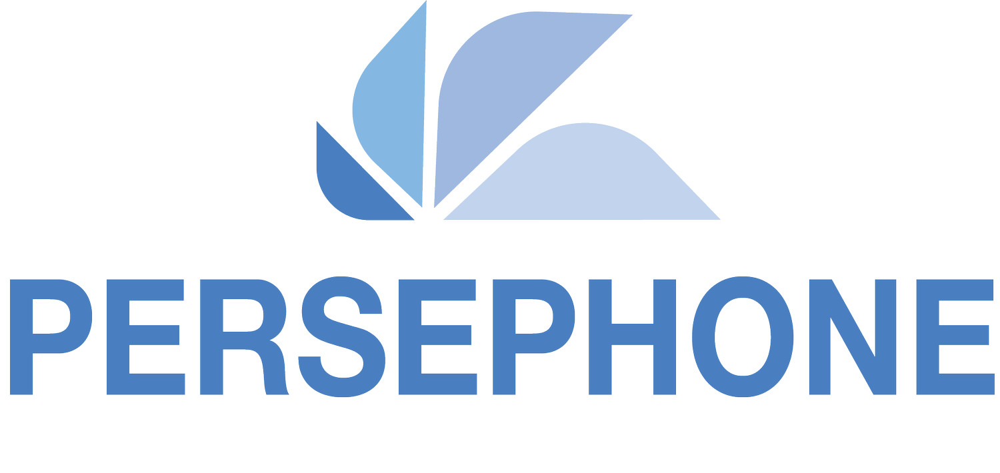
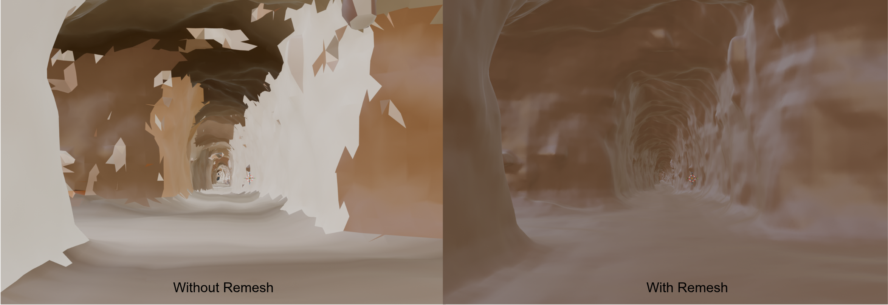
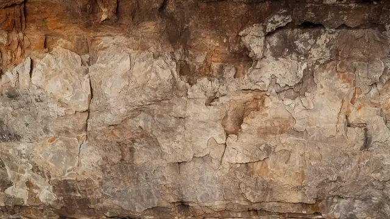
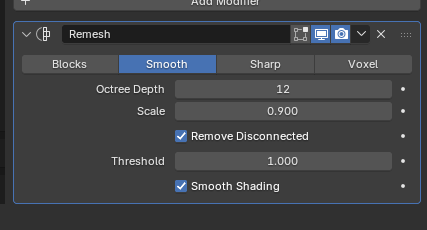

<p align="center">
  
</p>

<p align="center">
  <strong>Simulation world environments for mining robotics</strong><br>
  Compatible with ROS 2 Humble and Ubuntu 22.04
</p>


# Overview

Developed under the EU Horizon Europe [PERSEPHONE project](https://www.persephone-mining.eu) (Grant No. 101138451).

### PERSEPHONE Simulation Worlds – Open Source Release

As part of the PERSEPHONE project, the consortium is committed to supporting open science, reproducibility, and collaborative research in autonomous and sustainable mining technologies. To foster further innovation in underground robotics and digital mining, the PERSEPHONE simulation environments have been released as open-source.

The repository provides realistic simulation worlds representing deep and abandoned underground mine environments, developed using structural and operational insights obtained from industrial mining partners within the project. These environments are intended to support research and development activities related to:


The simulation worlds have been designed to enable reproducible benchmarking and testing of robotics and AI solutions in realistic subterranean conditions without requiring access to physical mining infrastructure. The environments can be used by researchers, developers, and industrial stakeholders working in mining automation, field robotics, and underground autonomy.
The PERSEPHONE-WORLDS repository will continue to evolve throughout the project, with additional environments, datasets, and integration examples being progressively released. By making these resources openly accessible, PERSEPHONE aims to encourage collaboration, accelerate innovation, and contribute to the advancement of safe, sustainable, and autonomous mining technologies.
### Acknowledgement
The PERSEPHONE consortium would like to acknowledge and thank Grecian Magnesite (GM) for providing the underground mine structural data and operational insights that enabled the development of these realistic simulation environments. Their contribution has been essential for creating representative underground scenarios for the validation of autonomous mining technologies.

**Keywords:** Autonomous navigation in GPS-denied underground environments · Multi-robot coordination and exploration · Risk-aware path planning and traversability analysis · Autonomous drilling and mining operations · Sensor fusion, localization, and mapping · Digital twin development and validation


## World Environments

### Underground Mine Environments

Based on the real abandoned Koutzi magnesite mine in Greece. All mine worlds use textured OBJ meshes with realistic cave-wall materials.

<p align="center">
  
</p>

| World File | Description |
|---|---|
| `Koutzi-UG-Mine.sdf` | Full-scale baseline mine — clean tunnel geometry |
| `Koutzi-UG-Mine-small.sdf` | Rescaled variant with ~2 m × 2 m cross-section for narrow-corridor testing |
| `Koutzi-UG-Mine-deformed.sdf` | Baseline mine with tunnel deformation (structural hazard scenario) |
| `Koutzi-UG-Mine-rockfall.sdf` | Baseline mine with rockfall debris obstacles |
| `Koutzi-UG-Mine-deformed-and-rockfall.sdf` | Combined deformation and rockfall — worst-case hazard scenario |
| `GM-KUM.sdf` | Grecian Magnesite – Koutzi Underground Mine in alternative STL/OBJ mesh format |
| `mines.sdf` | Generic mine tunnel with cave-wall texture |
| `mines_with_magnesite.sdf` | Generic mine with embedded magnesite mineral deposit geometry |

**Example texture:**

<p align="center">
  
</p>


## Usage with ROS 2 Humble

### Requirements

- [ROS 2 Humble](https://docs.ros.org/en/humble/Installation.html)
- [Ignition Fortress](https://gazebosim.org/docs/fortress/install)


```bash
sudo apt install ros-humble-ros-gz
```

### 1. Set the Gazebo model path

The worlds reference meshes via `model://` URIs. Set the resource path once per session (or add to your `.bashrc`):

```bash
export IGN_GAZEBO_RESOURCE_PATH=$IGN_GAZEBO_RESOURCE_PATH:/path/to/PERSEPHONE-WORLDS/meshes
```

### 2. Launch standalone (Ignition Gazebo)

```bash
ign gazebo /path/to/PERSEPHONE-WORLDS/worlds/<world_file>.sdf
```

### 3. Launch with ROS 2 Humble

```bash
source /opt/ros/humble/setup.bash

ros2 launch ros_gz_sim gz_sim.launch.py \
  gz_args:="/path/to/PERSEPHONE-WORLDS/worlds/<world_file>.sdf"
```

**Quick-reference — replace `<world_file>` with any of the following:**

| Environment | World file |
|---|---|
| Koutzi Mine (baseline) | `Koutzi-UG-Mine.sdf` |
| Koutzi Mine (small) | `Koutzi-UG-Mine-small.sdf` |
| Koutzi Mine (deformed) | `Koutzi-UG-Mine-deformed.sdf` |
| Koutzi Mine (rockfall) | `Koutzi-UG-Mine-rockfall.sdf` |
| Koutzi Mine (deformed + rockfall) | `Koutzi-UG-Mine-deformed-and-rockfall.sdf` |
| GM-KUM | `GM-KUM.sdf` |
| Generic mine | `mines.sdf` |
| Mine with magnesite | `mines_with_magnesite.sdf` |
| Maze | `maze.sdf` |
| Depot | `depot.sdf` |
| Warehouse | `warehouse.sdf` |
 
## Mesh Customization

The OBJ and STL meshes can be remeshed in [Blender](https://www.blender.org) to achieve any desired level of detail:

<p align="center">
  
</p>

1. Import the target mesh (`meshes/<model>/meshes/*.obj` or `*.stl`) into Blender.
2. Apply the **Remesh** modifier and adjust the voxel size or octree depth to the desired resolution.
3. Export as OBJ and update the corresponding `model.sdf` geometry URI if the filename changes.


## Contributors

| Name | Affiliation |
|---|---|
| Theodoros Antonios Frantzis | University of Patras |
| Akash Patel | Luleå University of Technology |
| Vignesh Kottayam Viswanathan | Luleå University of Technology |


### License

This work is licensed under the <a href="https://creativecommons.org/licenses/by/4.0/">Creative Commons Attribution 4.0 International License</a>


<p align="center">
  <sub>Funded by the European Union's Horizon Europe Research and Innovation Programme · Grant Agreement No. 101138451</sub>
</p>